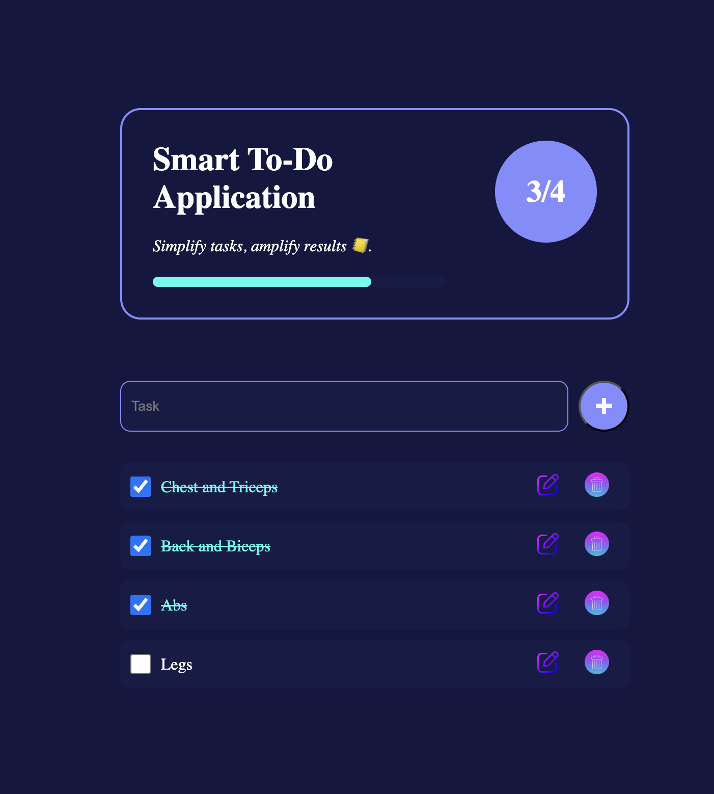
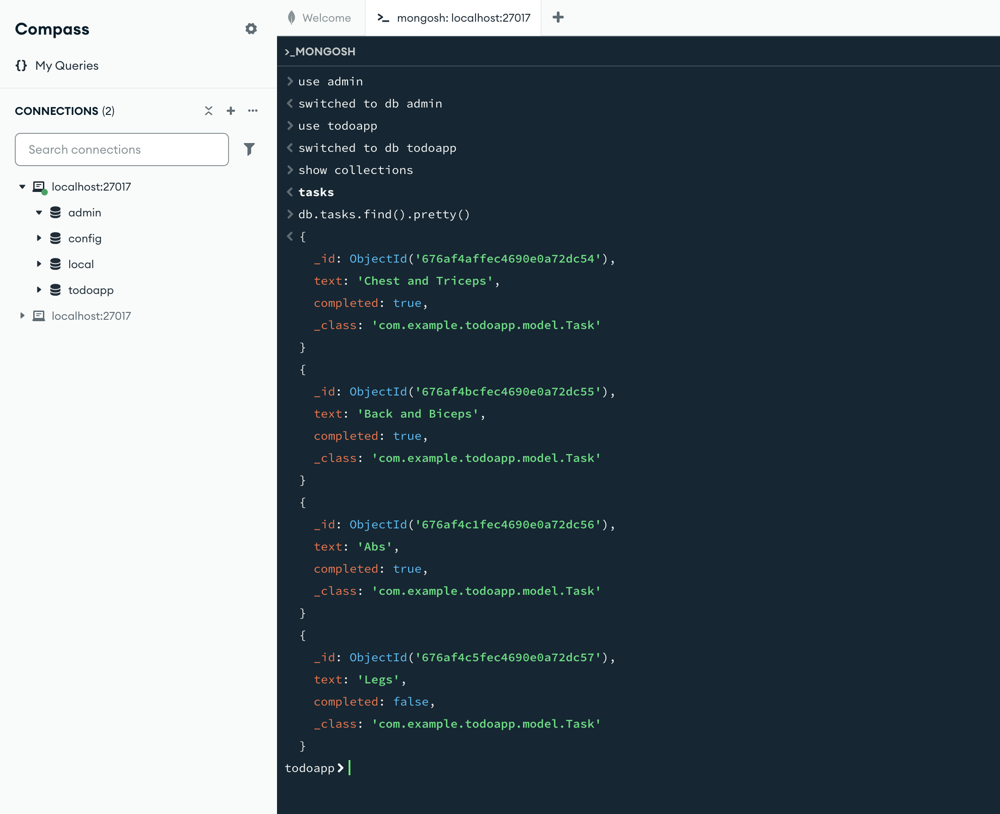

# Smart To-Do Application

Smart To-Do Application is a responsive and dynamic task management web app designed to simplify task tracking. Built in two phases, this project implements a frontend with HTML, CSS, and JavaScript and a backend using Spring Boot and MongoDB.

## Features

- **Frontend**:
  - Responsive UI with progress bar for completed tasks.
  - Task operations: Add, Edit, Delete, and Mark as Completed.
  - Local storage for persistent task management.
  - Visual confetti celebration when all tasks are completed.

- **Backend**:
  - Backend implemented using Spring Boot.
  - MongoDB for CRUD operations.
  - Synchronization with the frontend for real-time updates.

## Tech Stack

- **Frontend**:
  - HTML, CSS, JavaScript
  - Confetti.js for animations

- **Backend**:
  - Spring Boot
  - MongoDB

## Installation and Setup

### Prerequisites
- [Node.js](https://nodejs.org/)
- [Java 17+](https://www.oracle.com/java/technologies/javase-jdk17-downloads.html)
- [Spring Boot](https://spring.io/projects/spring-boot)
- [MongoDB](https://www.mongodb.com/try/download/community)

### Frontend

1. Clone the repository:
   ```bash
   git clone https://github.com/yashwanthm998/Quinbay-TODO-Application-Phase2.git
   ```
2. Navigate to the project directory:
   ```bash
   cd Quinbay-TODO-Application-Phase2

   ```
3. Open the `index.html` file in a browser.

### Backend

1. Navigate to the backend directory:
   ```bash
   cd todoapp
   ```
2. Build the Spring Boot application:
   ```bash
   mvn clean install
   ```
3. Run the application:
   ```bash
   mvn spring-boot:run
   ```
4. Ensure MongoDB is running locally on its default port (27017).

### Integration

- The backend APIs are available at `http://localhost:8080`.
- Update the API endpoints in the frontend code if required.

## Usage

1. Open the frontend in a browser.
2. Enter tasks in the input field and press `+` to add tasks.
3. Manage tasks using edit, delete, and complete options.
4. Monitor progress using the stats and progress bar.

## API Endpoints

### Task Operations

- **Add Task**: `POST /api/tasks`
  ```json
  {
    "text": "Sample Task",
    "completed": false
  }
  ```

- **Get All Tasks**: `GET /api/tasks`

- **Update Task**: `PUT /api/tasks/{id}`
  ```json
  {
    "completed": true
  }
  ```

- **Delete Task**: `DELETE /api/tasks/{id}`

## Screenshots

### Frontend



### Backend




